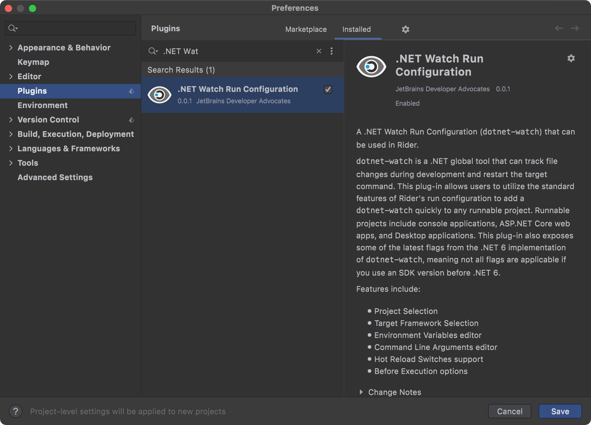
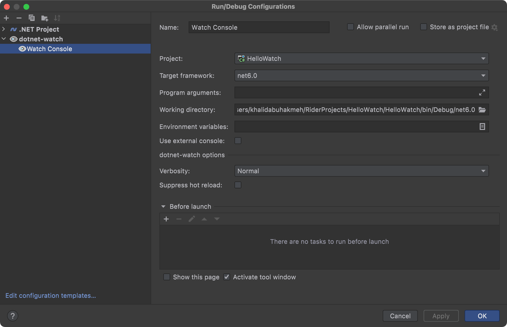
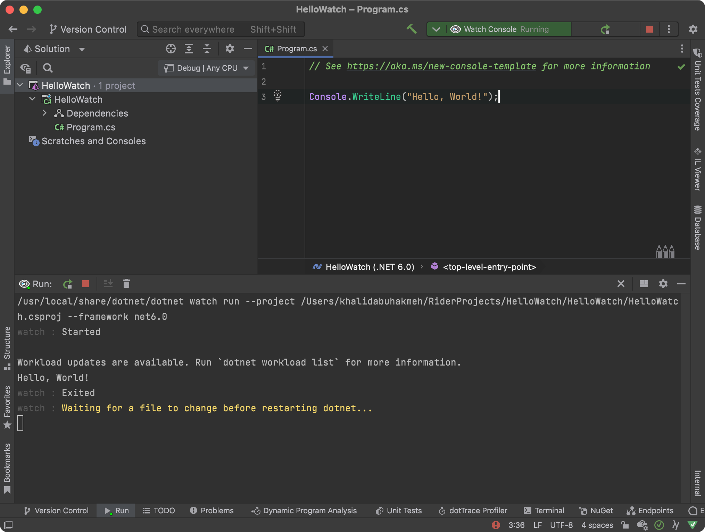

# .NET Watch Run Configuration

<!-- Plugin description -->
A .NET Watch Run Configuration (`dotnet-watch`) that can be used in Rider.

`dotnet-watch` is a .NET global tool that can track file changes during development and restart the target command. This plug-in allows users to utilize the standard features of Rider's run configuration to add a `dotnet-watch` quickly to any runnable project. Runnable projects include console applications, ASP.NET Core web apps, and Desktop applications. This plug-in also exposes some of the latest flags from the .NET 6 implementation of `dotnet-watch`, meaning not all flags are applicable if you use an SDK version before .NET 6.

Features include:

- Project Selection
- Target Framework Selection
- Program Arguments
- Working Directory
- Environment Variables editor
- Use External Console flag
- Verbosity (`--quiet`, `--verbose`, or default)
- Suppress Hot Reload (only .NET 6+)
- Before Launch options

<!-- Plugin description end -->

Plugin built by the JetBrains Developer Advocates.

## Screenshots

### Plugins Screen

### Settings

### Running In JetBrains Rider

## Installation

- Using IDE built-in plugin system:
  
  <kbd>Settings/Preferences</kbd> > <kbd>Plugins</kbd> > <kbd>Marketplace</kbd> > <kbd>Search for ".NET Watch Run Configuration"</kbd> >
  <kbd>Install Plugin</kbd>
  
- Manually:

  Download the [latest release](https://github.com/maartenba/DotNetWatch/releases/latest) and install it manually using
  <kbd>Settings/Preferences</kbd> > <kbd>Plugins</kbd> > <kbd>⚙️</kbd> > <kbd>Install plugin from disk...</kbd>